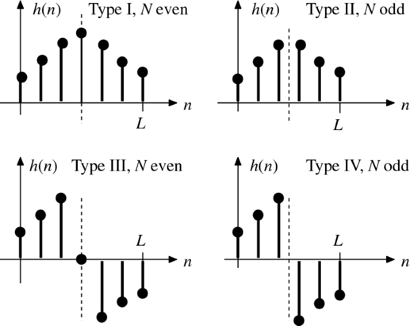
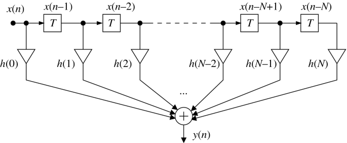
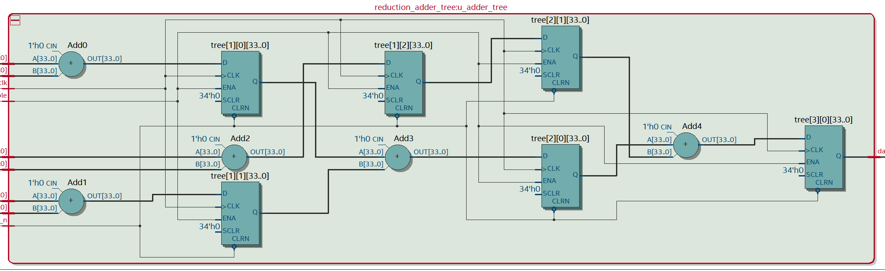
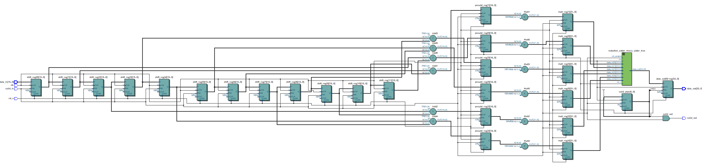
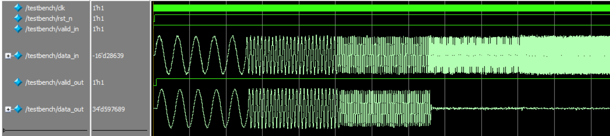
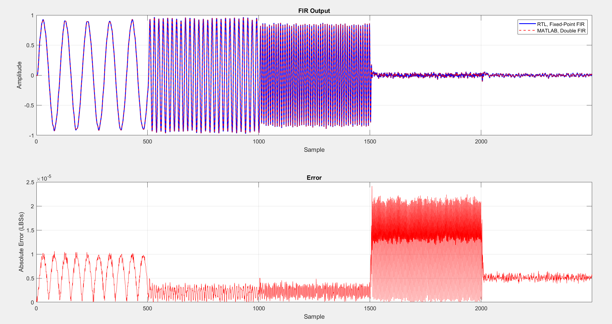

# Direct-Form FIR
A parameterizable Direct-Form Finite impulse response (FIR) filter implemented in SystemVerilog with verification using MATLAB scripts and SystemVerilog Testbench.

Clone the Repo:
```
git clone https://github.com/pletnevAE/FIR_direct_form.git
```

## Contents
- [Overview](#overview)
- [Theoretical Basis](#theoretical-basis)
  - [General FIR filter equation](#general-fir-filter-equation)
  - [Basic properties of FIR](#basic-properties-of-fir)
  - [Phase linearity](#phase-linearity)
  - [Symmetry of coefficients](#symmetry-of-coefficients)
- [Architecture](#architecture)
- [Interface](#interface)
  - [Parameters](#parameters)
  - [Signals](#signals)
- [Utilization](#utilization)
- [Simulation](#simulation)
- [Building the project out-of-the-box](#building-the-project-out-of-the-box)

## Overview
The module is designed for high-speed digital filtering within FPGA-based digital signal processing (DSP) chains. The design targets high $F_{max}$ through pipelining while preserving hardware resources (DSP blocks and logic) by exploiting symmetry of coefficients.

Typical applications:
+ Software Defined Radio (SDR);
+ Audio and video signal processing;
+ Digital communications;
+ Medical equipment;
+ Radiolocation and navigation;
+ Industry.

## Theoretical basis
### General FIR filter equation
A finite impulse response (FIR) filter computes the output sequence $y[n]$ as a weighted linear combination of present and past input samples $x[n]$:

$$y[n] = \sum_{k = 0}^{N - 1}{h_k \cdot x[n-k]},$$

where $N$ is the number of filter taps (length of the impulse response), and $h[k]$ are the filter coefficients.

In the Z-domain, the transfer function $H(z)$ is represented as a polynomial in $z^{-1}$:

$$H(z) = \sum_{k = 0}^{N - 1}{h_k \cdot z^{-1}}$$

### Basic properties of FIR
+ FIR filters are always absolutely stable since they have no poles outside the origin;
+ with symmetric (or anti-symmetric) coefficients, the filter produces a strictly linear phase response (all frequencies are delayed by the same period of time);
+ the circuit does not use previous output values.

The disadvantage of FIR filters is their requirement of a higher-order filter and, consequently, more memory and computational resources compared to IIR filters in order to achieve a steep cutoff in the magnitude response.

### Phase linearity



To avoid phase distortion across frequency components, digital filters often require a constant group delay (linear phase response). A FIR filter exhibits strictly linear phase if it's impulse response is symmetric (or anti-symmetric) arround midpoint:

$$h_k = h_{N - 1 - k}, \text{ for } k = 0, 1,...,[\frac{N - 1}{2}].$$

### Symmetry of coefficients
By factoring out common coefficients, the difference equation can be rewritten to perform pre-additions before multiplications:
+ for an even number of taps ($N$ is even):

$$y[n] = \sum_{k = 0}^{\frac{N}{2} - 1}{h_k \cdot (x[n - k] + x[n - (N - 1 - k)])}$$

+ for an odd number of taps ($N$ is odd):

$$y[n] = h_{\frac{N - 1}{2}} \cdot x[n - \frac{N - 1}{2}] + \sum_{k = 0}^{\frac{N - 3}{2}}{h_k \cdot (x[n - k] + x[n - (N - 1 - k)])}$$

This pre-adder structure reduces the required number of physical multipliers (DSP blocks) from $N$ to $M = [\frac{N}{2}]$.

## Architecture



The architecture consists of five fully pipelined processing stages to maximize operational frequency ($F_{max}$):
1. Tap Delay Line: a chain of $N$ registers storing the input history $x[n...n - N + 1]$.
2. Pre-Adder Stage: adds symmetric pairs from the shift register.
3. Multipliers: compute $M$ product terms simultaneously. Synthesis attribute `multstyle = dsp` enforce mapping to dedicated DSP blocks.
4. Pipelined Reduction Adder Tree: a binary tree structure with $[\log_2(M)]$ register levels. Each level performs pairwise addition.



5. Output and Valid Pipeline: registers the final output $y[n]$ and propagates the data validity strobe `valid_in` $\rightarrow$ `valid_out`. The total latency from `in_valid` to `out_valid` is given by ${\text{Latency}} = 1_{\text{shift}} + 1_{\text{preadd}} + 1_{\text{mult}} + [\log_2{M}]_{\text{tree}} + 1_{\text{out}}$.



Key implementation features:
+ Direct-Form FIR;
+ Asynchronous Active-Low reset (`rst_n`);
+ Parameterization;
+ Taking into account the symmetry of FIR coefficients;
+ Optimal bit depths of multipliers and accumulators when calculating via a MATLAB script (**FIR_calc.m**);
+ Full pipelining of the FIR structure.

## Interface
### Parameters
Parameter values are passed to the top module using a **fir_params.vh** header file.
| Parameter | Description |
|:--:|:--:|
| `N_COEFFS` | Number of coefficients |
| `IN_WIDTH` | Input word length |
| `COEFF_WIDTH` | Coefficients word length |
| `MULT_WIDTH` | Product word length |
| `MULT_FRACTION` | Product fraction length |
| `ACC_WIDTH` | Accumulator word length |
| `OUT_WIDTH` | Output word length |
| `OUT_FRACTION` | Output fraction length |

### Signals
| Port | Direction | Width | Description |
|:--:|:--:|:--:|:--:|
| `clk` | Input | 1 | Clock signal |
| `rst_n` | Input | 1 | Asynchronous Active-Low Reset |
| `valid_in` | Input | 1 | Input data valid |
| `data_in` | Input | `IN_WIDTH` | Input data |
| `valid_out` | Output | 1 | Output data valid |
| `data_out` | Output | `OUT_WIDTH` | Output data |

## Utilization
The project was synthesized for the 10M50DAF484C6GES FPGA on the DE10-Lite board using Quartus 22.1 Standard Edition.
| FPGA | Option | `N_COEFFS` | `IN_WIDTH` | `OUT_WIDTH` | LUT | FF | DSP | Fmax, MHz | Hold Slack, ns | Setup Slack, ns |
|:--:|:--:|:--:|:--:|:--:|:--:|:--:|:--:|:--:|:--:|:--:|
| 10M50DAF484C6GES | **Direct-Form** | 12 | 16 |34 | 565 | 564 | 12 | 190.44 | 0.363 | 14.749 |
| 10M50DAF484C6GES | Transposed | 12 | 16 |34 | 609 | 608 | 12 | 237.42 | 0.365 | 15.788 |
| 10M50DAF484C6GES | **Direct-Form** | 20 | 16 | 34 | 996 | 995 | 20 | 171.47 | 0.362 | 14.168 |
| 10M50DAF484C6GES | Transposed | 20 | 16 | 34 | 1014 | 1013 | 20 | 204.75 | 0.364 | 15.116 |
| 10M50DAF484C6GES | **Direct-Form** | 28 | 16 | 34 | 1365 | 1364 | 28 | 162.00 | 0.363 | 13.827 |
| 10M50DAF484C6GES | Transposed | 28 | 16 | 34 | 1408 | 1407 | 28 | 220.75 | 0.364 | 15.470 |
| 10M50DAF484C6GES | **Direct-Form** | 55 | 16 | 34 | 2674 | 2673 | 56 | 162.92 | 0.360 | 13.862 |
| 10M50DAF484C6GES | Transposed | 55 | 16 | 34 | 2743 | 2742 | 56 | 171.94 | 0.362 | 14.184 |
| 10M50DAF484C6GES | **Direct-Form** | 168 | 16 | 35 | 8412 | 8410 | 168 | 123.95 | 0.350 | 11.932 |
| 10M50DAF484C6GES | Transposed | 168 | 16 | 35 | 8371 | 8370 | 160 | 164.96 | 0.363 | 13.938 |

## Simulation
Before running simulation, a MATLAB script **FIR_calc.m** is used to generate stimulus signal, **fir_params.vh** header file and file with coefficients. The script also places the magnitude response graph in .png format in the specified directory.

After placing the generated files into the project root folder, it is necessary to set the required parameters in the SystemVerilog **testbench.sv**. By default, parameters are taken from the **fir_params.vh**.

| Parameter | Default Value | Description |
|:--:|:--:|:--:|
| `N_COEFFS` | - | Number of coefficients |
| `IN_WIDTH` | - | Input word length |
| `COEFF_WIDTH` | - | Coefficients word length |
| `MULT_WIDTH` | - | Product word length |
| `MULT_FRACTION` | - | Product fraction length |
| `ACC_WIDTH` | - | Accumulator word length |
| `OUT_WIDTH` | - | Output word length |
| `OUT_FRACTION` | - | Output fraction length |
| `CLK_PERIOD` | - | Clock period in ns |
| `CLK_ENABLE_DIV` | - | Clock division factor for determining the clock enable frequency |
| `RESET_CYCLES` | 10 | Number of clock cycles before reset release |
| `NUM_SAMPLES` | - | Number of stimulus samples |



Upon completion of the simulation, file with FIR output samples will be created at the path specified in the **testbench.sv** (defined within the *initial* block when opening the files).

A MATLAB script **FIR_analyze.m** is used to analyze the obtained results. It reads files generated during the simulation, calculates an FIR filter with double-type coefficients based on the given characteristics, determines the absolute and RMS error, SQNR (Signal-to-quantization-noise ratio).

Upon completion, the script plots the RTL FIR output signal alongside the reference FIR output, as well as the absolute errors.



The calculated values for these parameters are also displayed in the console:
```
==================== FIR REPORT ====================
Filter Type                  : lowpass
Filter Order                 : 167
Numerator Word Length        : 16
Numerator Frac. Length       : 17
Input Word Length            : 16
Input Frac. Length           : 15
Output Word Length           : 35
Output Frac. Length          : 32
Product Word Length          : 31
Product Frac. Length         : 32
Accum. Word Length           : 35
Accum. Frac. Length          : 32
Theoretical Error            : 8.538448e-05
Theoretical SQNR             : 81.87 dB
----------------------------------------------------
Maximum Absolute Error      : 5.091071e-05
RMS Error                   : 1.718218e-05
Actual Measured SQNR        : 89.13 dB

====================================================
```

## Building the project out-of-the-box
Scripts **run_build.bat**, **build.tcl**, **timing.tcl** and **sim.tcl** are implemented for building the project out-of-the-box. The script also starts the generation of the necessary files (**FIR_calc.m**), simulation in Modelsim and comparison of the FIR outputs with the reference model (**FIR_analyze.m**). For the scripts to work, the path to the **bin64** folder within the Quartus root directory must be included in the `PATH` environment variable in Windows.

To run the script, you need to enter the following in the command line from the directory **scripts**:
```
run_build.bat <build_path> -F_CLK <value> -F_S <value> -FILTER_TYPE <string> -F_PASS <value> -F_STOP <value> -F_PASS1 <value> -F_PASS2 <value> -F_STOP1 -F_STOP2 -A_PASS <value> -A_STOP <value> -A_PASS1 <value> -A_PASS2 <value> -A_STOP1 <value> -A_STOP2 <value> -IN_WL <value> -IN_FL <value> -H_WL <value>
```

To get help on the script, you need to enter the following in the command line:
```
run_build.bat <build_path> --help
```

Setting the parameter flags is not necessary; if one of them (or all of them) is not set, the parameter will take on the default value.

The scripts output project build information, a Compilation Report, STA results to the console and MATLAB chart.